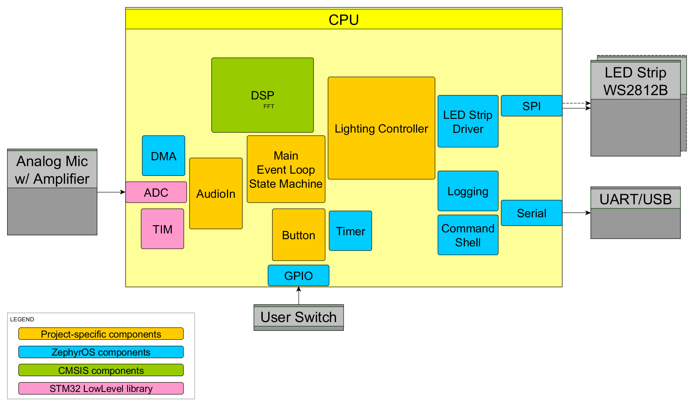
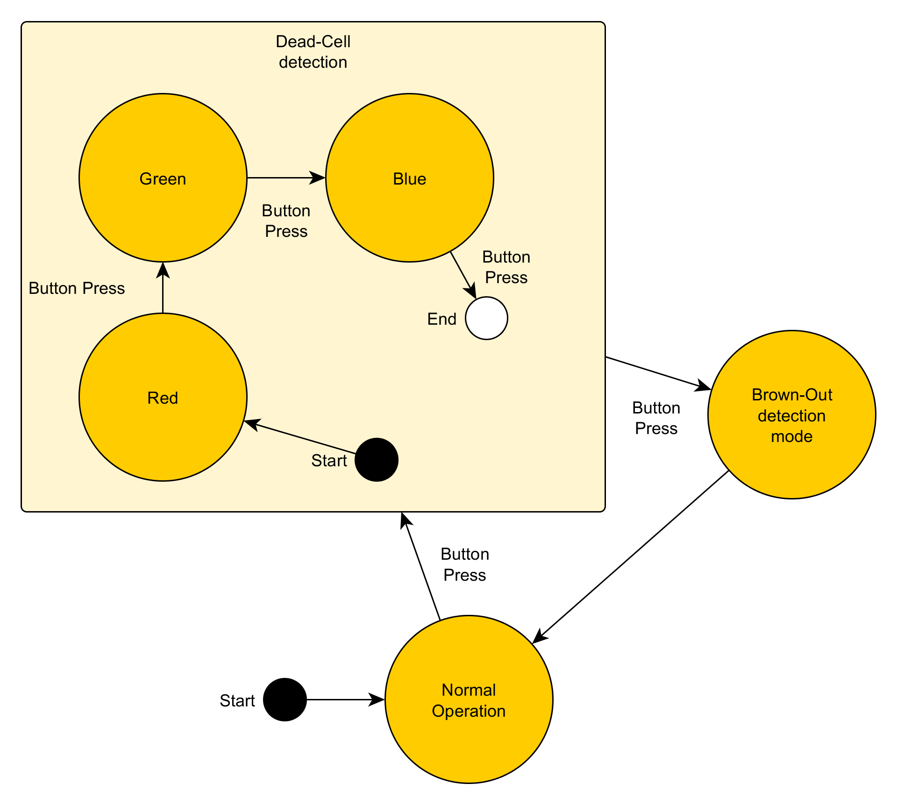

# feelights
A dancefloor lighting system using WS2812 LED strips based on ZephyrOS

## Application description
FeeLights is a dance floor lighting controller that aims to make dancing more pleasurable by adjusting the lighting of a venue to the energy of the music playing.
To capture audio, the FeeLights controller uses a built in microphone, so no additional audio cabling is required to install it in a dance venue.
The system requires WS2812B addressable LED strips as the light source. The controller can power a very short strip for bring-up testing, but in general the strips should be powered from external sources.
Multiple strips can be used in parallel to provide more light, but this version of FeeLights software does not support putting different patterns on more than one LED strip

Check out my demo:

[](https://www.youtube.com/watch?v=2CluzA2E0z4)

## Hardware description
The system is essentially a straightforward input/output data transformation system with a few auxiliary components.

The core of the system is a STM32F429I DISCOVERY evaluation board, sporting a pretty beefy STM32F429ZI MCU with a Cortex-M4 core and an FPU unit for DSP support.
FeeLights makes use of the MCU internal ADC and one SPI peripheral (MOSI line only) for WS2812B driving.
The STM32F429ZI offers 192 KB of SRAM and 2 MB of flash memory, which is more than enough for the software at this point.
The board offers an additional 8 MB of external SDRAM memory, but it was not necessary for this project.

Additional hardware components include:
- SN74HCT541N Octal Buffer as a level-shifter and line driver for communicating with the LED strip.
- Electret microphone with MAX9814 adjustable-gain amplifier from [Adafruit](https://learn.adafruit.com/adafruit-agc-electret-microphone-amplifier-max9814/).
- Optional UART connection to the PC for a debug shell.
- On-board user switch/button for switching to other operating modes of the device

The controller is powered via the DISCOVERY board USB port. 
Power consumption measurements were not conducted, but given it is a driver for LED strips that consume up to 9 Watts of power per 5 meters (16'4'), the power consumption of the controller can be considered negligible.

## Software description
The controller software is based on Zephyr OS and has been tested with version 3.1.99.



### Components description

The code is organized into several modules with well defined responsibilities.

#### Main module
Entry point of the software. Initializes other modules at startup and runs the main event loop.

The system states are also defined in this module, but maybe these can be extracted into separate modules.

#### Events module
Provides a simple API for:
- waiting for events, 
- emitting events informing the main loop to take action,
- starting and stopping a periodic timer that will allow for periodic actions.

#### AudioIn module
Module responsible for reading audio samples and generating an event once a new batch of samples is available.

The module generates an event every 512 samples at 40 kSamples/s, so approximately every 12,8ms

Due to a lacking implementation of the ADC API in Zephyr OS, the ADC and Timer module configuration had to be done bypassing the OS and using the STM32 LowLevel libraries.

The AudioIn module implementation was largely based on [infinity-drive](https://github.com/cycfi/infinity_drive), an open-source project by Cycfi Research (MIT License)

#### Button module
Aptly named, responsible for handling button presses with simple debouncing. Generates events any time the button is pressed and released.

#### Dsp module
Auxiliary module used for calculating the frequency magnitude spectrum using the CMSIS DSP Real FFT transform functions.

#### Lights module
The heart of the system, this module is responsible for translating sound into light.

The program creates colored "Orbs" of light that respond to changes in the sound spectrum and move around the physical space of the strip.

Most parameters of the orbs are random, the colors are chosen from a set of hard-coded palettes; In the end it's simple renderer with relatively simple logic, but this will be the focus of future development.

#### Strip module
A simple wrapper used for pushing pixels out to the LED strip.


### Libraries and other third party software

#### Zephyr OS
This project was based on Zephyr, an open-source, scalable real-time operating system licensed under the Apache License Version 2.0.
I highly recommend it for quick prototyping, because it offers lots of features with reasonable defaults, good documentation and examples, and a broad range of supported hardware.
Find their latest documentation [here](https://docs.zephyrproject.org/latest/index.html) or check out their code on [github](https://github.com/zephyrproject-rtos/zephyr).

#### CMSIS DSP
CMSIS DSP library was used for an efficient FFT implementation. It is also licensed under the Apache License Version 2.0.

The documentation for the library can be found [here](https://arm-software.github.io/CMSIS_5/DSP/html/index.html)

### System state machine
The code is architected as a simple, event driven state-machine.



Internally the above states handle other internal events, but the top-level state transitions are described in the above diagram.

In most cases the device never leaves the Normal Operation mode, but upon installation or inspection it might be useful to cycle through modes that allow to check if all LEDs are operational and power distribution is as it should be.

## Setup instructions

### Linux

To build the software:
1. Install `west` and the Zephyr SDK by following the [Zephyr Getting Started Guide](https://docs.zephyrproject.org/latest/develop/getting_started/index.html)
2. Initialize a Zephyr workspace using the following commands:
```
# initialize my-workspace for the example-application (main branch)
west init -m git@github.com:ehmeth/feelights.git --mr main fl-workspace
# update Zephyr modules
cd fl-workspace
west update
```
3. Build the software using the following commands:
```
cd feelights
west build -b stm32f429i_disc1 -p -s app
```

4. To flash the software onto the board use
```
west flash
```

### Windows
All development can be done using a WSL2 instance of a Linux distro (tested on Ubuntu 20.04 LTS)

To connect the board to the Linux distro via USB additional are required using an open-source project called `usbipd-win`.
You can follow the instruction on the [usbpid-win github page](https://github.com/dorssel/usbipd-win) or follow [this guide from Microsoft](https://docs.microsoft.com/en-us/windows/wsl/connect-usb).

After that you should be able to connect the board to your WSL instance, but there might be an access rights problem to flash/debug the device.
In theory the Zephyr getting started guide includes adding special rules to allow using the device without super-user rights, but those tend not to be loaded on first boot of the WSL instance.
The following command will force a reload of the `udev` rules and you should be able to connect without `sudo`..
```
sudo service udev restart; sudo udevadm control --reload-rules
```

### Debugging
The Zephyr build tool `west` offers a one-command way to connect a gdb debugger instance to the device, just type:
```
west debug
```

I would highly recommend finding a good gdb guide and familiarize yourself with at least the basics of running and stopping execution, setting breakpoints and displaying variable contents.. Other than that debugging "just works".

## Future
The project was developed in a hurry and in spare time, while maintaining a full-time job and teaching people to dance. There is a lot of uncovered ground here.

### Further development
Features that were dropped due to time limitations:
- An ML model for choosing color palettes based on the overall feel of the music
- Logic responsible for detecting music structure elements, up- and down-beats, phrases, breaks, etc. and reflecting that information in the light-space
- Support for rendering the light-space onto at least 2 different strips to create a coherent image

Features that came up during development:
- Adding an audio-in port to get an better quality signal.
- Support for a better microphone and ADC.
- Add over-the-air update for future ML model and logic updates.
- There seems to be quite a lot of performance gains to be had.

### Productizing potential
I haven't done a lot of market research on this, but I assume there is a wide variety of product for lighting dance venues. My feeling is that those products mostly work randomly and both the venue owners and clients are so accustomed to that, that they don't expect anything more. Maybe this project could change their mind, maybe they wouldn't notice anything different.

To even consider selling this as a product I would have to:
- Design proper hardware with more emphasis on choosing well-suited components. 
  Current hardware is a mix of stuff I had lying around, what I could buy in a short time, and an evaluation board chosen for the current cohort of the Making Embedded Systems course.
  I'm confident there is area for improvement here.
- Add more logic to the light generation algorithm to actually make the lighting feel in sync with the music. 
  The current results are pretty good considering the amount of randomness in the decisions, but it's definitely not polished.
- Do at least one mid-sized dance-room deployment and test the system in action. Check if the results are satisfactory and if the system performs at scale.
- Do robustness testing, make sure the device behaves reliably for at least a year of frequent use

## Profiling and fixing the audio sampling

At the prototyping stage I setup the ADC reading using the async version of the Zephyr ADC API to collect samples every 22us.
This would roughly reflect the desired sampling frequency. After introducing some timing measurements to verify everything is working as expected, it was clear there was a problem, as I noted in the comment:
```
 * Samples: 21,651,281 ns <- This is obviously a problem...
 * Fft:      1,195,757 ns 
 * Update:     229,720 ns
 * Pixel:    2,471,695 ns
 * Total    25,548,456 ns
128 samples at 22us should amount to 2.8ms, not 21.6ms
```

After a not-so-brief code inspection I discovered that the ADC async API still relied on Zephyr system ticks and to trigger ADC measurements one by one.
In theory I could have increased the system tick frequency and hope for the best, but I assumed that would not provide a deterministic sampling frequency and waste CPU time.
I've decided to go with ADC triggered by a TIMer unit and data transferred by DMA, and got pretty stable, reliable results.

After lowering the sampling rate to 40kSamples/s and increasing the number of samples to 512 per batch, the expected time between batches was measured at a steady ~12.8ms.

## Acknowledgements

I know it may seem cheesy, but I want to thank my partner Bogumiła Galińska for all her support during the development of this project. Being there when I was hyper-focused on this project meant the world to me.

I would also like to thank everybody in the Orange Stars cohort of the Making Embedded Systems course on Classpert. You are a great support group, I loved every minute we got to spend together and when I got to see the problems from diverse perspectives.

Many, many thanks to the mentors and coordinators of this course, and of course our teacher, Elecia. The collective amount of knowledge, expertise and support was overwhelming.

Classpert people went above and beyond to facilitate this course too, so also lots of thanks to them, especially Jason Rouleau.

And last but not least thanks to my employer Codelab sp. z o.o. for paying for this experience.
